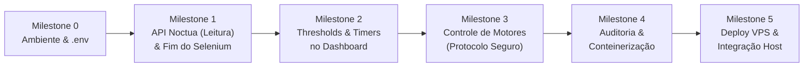

# ROADMAP DO PROJETO: TRANSIÇÃO NOCTUA IOT & CONTAINERIZAÇÃO

Este documento estabelece o roteiro de desenvolvimento iterativo para modernizar a coleta de dados da Piscicultura, migrando do scraping (Selenium/Chromium) para chamadas diretas à API GraphQL (AWS AppSync), implementando controles no frontend e preparando a infraestrutura para conteinerização leve na VPS.

---

## 📌 Visão Geral dos Marcos (Milestones)

---

## Milestone 0: Preparação de Ambiente & Runbook do `.env`
> **Foco**: Configuração das variáveis de ambiente necessárias, obtenção de credenciais da API e validação dos drivers locais.

- [x] Criar `.env` a partir do modelo atualizado (`.env.example`).
- [x] Documentar obtenção da chave `x-api-key` da AWS AppSync no painel web Noctua e configurar em `NOCTUA_API_KEY`.
- [x] Definir `NOCTUA_READ_ONLY=true` como trava de segurança padrão.
- [x] Configurar credenciais do banco local (SQLite e PostgreSQL de desenvolvimento).
- [x] Validar conectividade inicial de rede com o endpoint AppSync via script de diagnóstico simples.

**Critério de Aceite / Teste**:
- Script de diagnóstico (`python -m src.services.noctua_client --test`) conecta ao endpoint AppSync da AWS sa-east-1 com sucesso (HTTP 401 para chave de placeholder e 200 para chave real).

---

## Milestone 1: Cliente GraphQL & Saneamento da Tomada de Dados
> **Foco**: Substituição completa do Selenium por chamadas HTTP puras para tomada de telemetria dos tanques.

- [x] **Novo Módulo**: Criar `src/services/noctua_client.py` encapsulando as queries GraphQL:
  - `listSensorDataByGatewayIdAndUpdatedAt` (dados atuais: O2, temperatura, saturação, motores, sinal).
  - `listHourlyDataByEndpointIdAndTimestamp` (histórico agregado por hora).
- [x] **Refatoração**: Adaptar `src/scrape/monitor_data.py`:
  - Remover inicialização do ChromeDriver, Selenium e BeautifulSoup.
  - Chamar `NoctuaClient` diretamente, mapeando os MACs dos tanques para as estruturas do banco.
  - Persistir as leituras nas tabelas existentes (`leituras` no SQLite e Postgres).
- [x] **Testes Automatizados**:
  - Criar `tests/test_noctua_client.py` com mocks de resposta GraphQL e testes de parsing de payloads.
  - Testar tratamento de erros (timeout, credencial expirada, retorno nulo).
- [x] **Validação de Regras de Negócio**:
  - Validar se a regra de filtragem de lotes ativos (`data_abate IS NULL`) continua respeitada nos alertas.

**Critério de Aceite / Teste**:
- Executar `pytest tests/test_noctua_client.py` com 100% de aprovação.
- Executar `pytest tests/test_monitor_data.py` garantindo persistência no SQLite e regras de negócio.

---

## Milestone 2: Gestão de Thresholds e Timers no Dashboard Web
> **Foco**: Leitura e edição segura de limiares operacionais e janelas de liga/desliga de aeradores via frontend.

- [x] **Backend (API GraphQL & Flask)**:
  - Adicionar no `NoctuaClient` a operação `get_endpoint_config(id)` para consultar `criticalO2`, `criticalO2Max`, `autoOn` e o JSON de `timer`.
  - Criar rota `GET /api/endpoints` e `GET /api/endpoint/<mac>` no Flask para expor os parâmetros atuais do tanque.
  - Criar rota `POST /api/endpoint/<mac>/thresholds` para atualizar limiares via mutation `updateEndpoint`.
  - Criar rota `POST /api/endpoint/<mac>/timers` para atualizar janelas de funcionamento via mutation `updateEndpoint`.
  - Implementar validação estrita de inputs (ex: limites físicos de O2 permitidos entre 1.0 e 8.0 mg/L).
- [x] **Frontend (`dashboard.html`)**:
  - Adicionar aba/painel "Automação, Thresholds & Acionamento de Motores".
  - Formulário para alteração de threshold mínimo e máximo com confirmação visual.
  - Visualizador/editor de janelas de timers para motores.
- [x] **Testes**:
  - Atualizar `tests/test_web_dashboard.py` testando novas rotas autenticadas de endpoints, thresholds e timers.

**Critério de Aceite / Teste**:
- Dashboard exibe os campos e executa integração com API GraphQL.
- Todos os testes de rotas web aprovados (`pytest tests/test_web_dashboard.py`).

---

## Milestone 3: Acionamento Controlado de Motores (Safe Protocol)
> **Foco**: Envio de comandos manuais para motores/aeradores com travas de segurança e confirmação de entrega.

- [x] **Mapeamento de Protocolo**:
  - Mutation `createCommandMessages` com formato estrito e allowlist de tanques.
- [x] **Backend de Comandos**:
  - Implementar envio via mutation `createCommandMessages` com geração de UUID `messageId`.
  - Criar consulta de status `get_command_status` para acompanhar ciclo de vida (`SENT` -> `DELIVERED`).
  - Bloquear envio se `NOCTUA_READ_ONLY=true` (lançando `NoctuaReadOnlyException`).
- [x] **Frontend**:
  - Adicionar botões de acionamento manual por motor com confirmação explícita de segurança.
  - Feedback visual e mensagens informativas no dashboard.
- [x] **Testes**:
  - Testar bloqueio por `NOCTUA_READ_ONLY` e envio seguro em `tests/test_noctua_client.py` e `tests/test_web_dashboard.py`.

**Critério de Aceite / Teste**:
- Comandos nunca são disparados sem confirmação prévia e respeitam as travas de offline e read-only.

---

## Milestone 4: Auditoria de Dependências & Conteinerização Completa
> **Foco**: Reduzir a pegada computacional para o mínimo absoluto e empacotar a aplicação em containers leves.

- [x] **Auditoria de Recursos**:
  - Remover `selenium`, drivers do Chromium e pacotes órfãos do `requirements.txt`.
  - Adicionar `requests` e `gunicorn` para produção eficiente.
- [x] **Dockerização Multi-Serviço**:
  - Criar `Dockerfile` unificado leve (Python 3.11 Slim com Gunicorn).
  - Criar serviço autônomo `src/jobs/collector_service.py` eliminando cron bare-metal.
  - Atualizar `docker-compose.yml` com suporte a variáveis de portas (`WEB_PORT`) e reutilização de PostgreSQL externo.
- [x] **Testes de Regressão**:
  - Executar suíte completa (`bash scripts/run_tests.sh`) com 100% de aprovação (44 testes aprovados).

---

## Milestone 5: Deploy e Homologação na VPS
> **Foco**: Integração com a infraestrutura da VPS sem conflito com portas ou serviços pré-existentes.

- [ ] **Auditoria da VPS**:
  - Listar portas ativas na VPS (`ss -tuln`) e identificar portas disponíveis.
  - Checar existência de PostgreSQL em execução na VPS para compartilhamento de banco de dados.
- [ ] **Deploy**:
  - Realizar commit e git push das alterações validadas localmente.
  - Na VPS, clonar ou puxar as alterações (`git pull`).
  - Configurar `.env` da VPS apontando para o PostgreSQL já existente e porta web livre (ex: `5050` ou `8080`).
  - Subir a stack com Docker Compose.
- [ ] **Validação Final**:
  - Acessar o dashboard pelo IP/domínio da VPS na porta configurada.
  - Conferir coleta automática e alertas no Telegram.
  - Registrar relatório de deploy no diário de bordo em `knowledge/diario/`.

**Critério de Aceite / Teste**:
- Sistema operando 24/7 na VPS com coleta estável, sem conflito de portas e com consumo mínimo de recursos.
