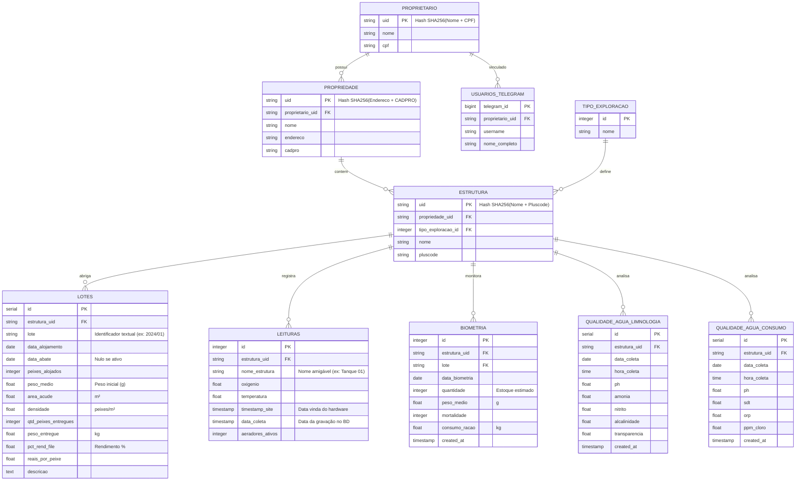

# Modelo de Entidade Relacionamento (MER)

Este documento descreve a estrutura de dados atualizada do sistema de monitoramento de piscicultura, refletindo o padrão técnico C.VALE / PATEL e a arquitetura multilocação (propriedades e estruturas).

## Diagrama

## Entidades de Cadastro

### Proprietário e Usuários
Gestão de acesso e vínculo. O UID é imutável e gerado por hash para garantir privacidade e unicidade.

### Estrutura
Unidade física produtiva. O campo `nome` é o que aparece no dashboard, enquanto o `uid` garante a integridade dos dados históricos mesmo se o tanque for renomeado.

## Tabelas de Monitoramento (Operacional)

### Lotes (Ciclo de Vida)
Implementa o padrão de "Ficha Verde". Registra desde a entrada (alojamento) com densidade automática até o fechamento financeiro (abate/rendimento).

### Leituras (Telemetria)
Armazena os dados vindos do Scraper. Inclui `nome_estrutura` para facilitar relatórios rápidos e `aeradores_ativos` para monitoramento de automação.

### Biometria e Qualidade da Água
Registros manuais feitos via Bots Telegram. Estão vinculados à estrutura e, no caso da biometria, ao lote vigente para cálculo de Conversão Alimentar (CA).
