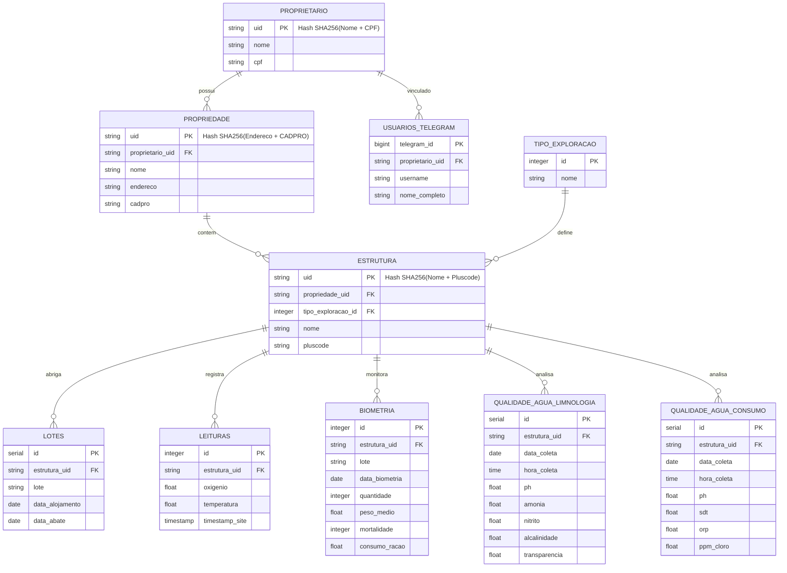

# Modelo de Entidade Relacionamento (MER)

Este documento descreve a nova estrutura de dados do sistema de monitoramento de piscicultura e outras explorações.

## Diagrama

## Entidades de Cadastro

### Proprietário
Armazena as informações do dono das propriedades. O UID é gerado via SHA256 concatenando Nome e CPF.

### Propriedade
Representa uma fazenda ou unidade produtiva. Vinculada a um proprietário. UID gerado via SHA256 concatenando Endereço e CADPRO.

### Estrutura
Unidade física onde ocorre a exploração (ex: Tanque 01, Aviário A). Vinculada a uma propriedade e a um tipo de exploração. UID gerado via SHA256 concatenando Nome e Pluscode.

### Tipo de Exploração
Catálogo de atividades suportadas (Piscicultura, Avicultura, etc).

## Tabelas de Monitoramento (Dimensionalidades)

As tabelas de `leituras`, `biometria` e `lotes` agora referenciam `estrutura_uid` em vez de nomes de tanques genéricos, permitindo rastreabilidade entre diferentes propriedades e tipos de exploração.

A qualidade da água foi dividida em duas categorias:
- **Limnologia**: Para ambientes aquáticos (peixes).
- **Consumo**: Para água de bebida animal (aves, suínos, etc).
