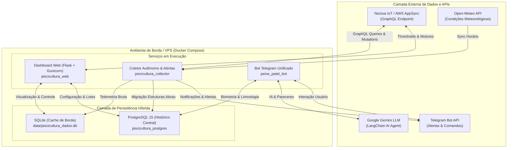

# Especificações Técnicas e Arquiteturais do Sistema (System Specifications)

> **Documento:** Especificações Completas do Sistema de Monitoramento e Automação de Piscicultura  
> **Versão:** 2.0 (Modernizada - API GraphQL & Containers)  
> **Status:** Vigente  
> **Última Atualização:** 28 de Setembro de 2026  

---

## 1. Visão Geral e Escopo

O **General System Scraping / Piscicultura Monitoring & Automation** é uma plataforma distribuída de engenharia agroindustrial voltada para o monitoramento contínuo, análise preditiva e automação de tanques de piscicultura intensiva (especialmente tilapicultura, alinhada aos padrões operacionais e zootécnicos C.Vale / PATEL).

### 1.1 Objetivos Principais
1. **Mitigação de Mortalidade por Hipóxia:** Monitoramento contínuo em tempo quase real dos níveis de Oxigênio Dissolvido ($O_2$), Temperatura da Água e Saturação, emitindo alertas imediatos em condições críticas.
2. **Predição e Otimização de Alimentação (Arraçoamento):** Correlação entre telemetria aquática e condições meteorológicas (temperatura ambiente, umidade, pressão barométrica, nebulosidade) via Inteligência Artificial (Google Gemini) para sugerir a melhor janela de arraçoamento e prever o consumo de oxigênio.
3. **Controle Seguro de Motores e Aeradores:** Interface autenticada para consulta de thresholds operacionais, configuração de janelas de timers e acionamento manual remoto de motores via protocolo seguro com confirmação e trava de leitura (*Read-Only*).
4. **Governança e Rastreabilidade de Lotes:** Acompanhamento do ciclo de vida das estruturas através do conceito de *Ficha Verde*, registrando biometria, consumo de ração, conversão alimentar e limnologia.

---

## 2. Arquitetura de Alto Nível

O sistema adota uma arquitetura em camadas orientada a serviços leves conteinerizados, preparada para execução em dispositivos de borda (*Edge*, ex: Raspberry Pi 3B rodando Alpine Linux) ou servidores em nuvem (VPS Linux).



---

## 3. Modelo de Persistência e Dados

A persistência do sistema é estritamente híbrida e dividida em duas responsabilidades claras:

### 3.1 SQLite (`data/piscicultura_dados.db`) - Camada de Borda e Cache Rápido
* **Propósito:** Buffer de leitura rápida, histórico de telemetria imediata e suporte a operações offline da borda sem dependência de conectividade de rede externa.
* **Tabelas Principais:**
  * `leituras`: Registra telemetria bruta recebida da API (`id`, `estrutura_uid`, `nome_estrutura`, `oxigenio`, `temperatura`, `timestamp_site`, `data_coleta`, `aeradores_ativos`, `saturacao`, `pressao_barometrica`, `bateria`).
  * `clima_historico`: Sincronização horária de meteorologia local (`id`, `data_coleta`, `temperatura`, `umidade`, `pressao`, `probabilidade_chuva`, `cobertura_nuvens`).
  * `web_users`: Usuários e senhas hash com salt (PBKDF2-SHA256) para autenticação do dashboard web.
  * `system_state`: Armazena o estado global de suspensão (`suspended` = 0 ou 1) e timestamp da última alteração.

### 3.2 PostgreSQL (`piscicultura_history`) - Camada Canônica e Histórico Transacional
* **Propósito:** Fonte Única da Verdade (*SSOT - Single Source of Truth*), garantindo integridade referencial, rastreamento multilocação e históricos consolidados de safras/lotes.
* **Modelo Entidade-Relacionamento:**
  * `proprietario`: Identificação do produtor com chave primária em hash SHA256 (`uid`, `nome`, `cpf`).
  * `propriedade`: Estabelecimentos rurais (`uid`, `proprietario_uid`, `nome`, `endereco`, `cadpro`).
  * `tipo_exploracao`: Categorias de cultivo (ex: Piscicultura - Berçário, Engorda).
  * `estrutura`: Unidades físicas de viveiros/tanques (`uid`, `propriedade_uid`, `tipo_exploracao_id`, `nome`, `pluscode`).
  * `lotes`: Ciclo de vida dos peixes (*Ficha Verde*).
    * `id`, `estrutura_uid`, `lote`, `data_alojamento`, `data_abate`, `peixes_alojados`, `peso_medio`, `area_acude`, `densidade`, `qtd_peixes_entregues`, `peso_entregue`, `pct_rend_file`, `reais_por_peixe`, `descricao`.
    * **Regra de Ouro:** Um lote é considerado **ATIVO** se e somente se `data_abate IS NULL`.
  * `leituras`: Histórico consolidado de telemetria migrado do SQLite (apenas de estruturas com lotes ativos).
  * `biometria`: Acompanhamento de crescimento (`data_biometria`, `quantidade`, `peso_medio`, `mortalidade`, `consumo_racao`).
  * `qualidade_agua_limnologia`: Parâmetros físico-químicos (`ph`, `amonia`, `nitrito`, `alcalinidade`, `transparencia`).
  * `qualidade_agua_consumo`: Parâmetros da água tratada/abastecimento (`ph`, `sdt`, `orp`, `ppm_cloro`).
  * `historico_pareceres_ia`: Registro cronológico dos pareceres emitidos pela IA (`parecer VARCHAR(500)`, `data_parecer`).
  * `controle_migracao`: Tabela de controle que registra o `ultimo_id_leituras` sincronizado do SQLite para o PostgreSQL, evitando reprocessamento de telemetria legada.

---

## 4. Especificações dos Módulos e Componentes

### 4.1 Módulo Noctua IoT Client (`src/services/noctua_client.py`)
Cliente síncrono HTTP para a API GraphQL (AWS AppSync) do ecossistema Noctua IoT.
* **Autenticação:** Header `x-api-key`.
* **Endpoints & Operações:**
  * `listSensorDataByGatewayIdAndUpdatedAt`: Telemetria em tempo real de todos os sensores associados ao Gateway ID.
  * `listHourlyDataByEndpointIdAndTimestamp`: Histórico de leituras agregadas por hora por endpoint MAC.
  * `getEndpoint(id)`: Consulta parâmetros operacionais do tanque (`criticalO2`, `criticalO2Max`, `autoOn`, `timer`, `engines`).
  * `updateEndpoint(input)`: Atualiza thresholds de alarme de oxigênio e matriz horária de timers.
  * `createCommandMessages(input)`: Envia comandos para motores e aeradores.
* **Protocolo de Segurança e Travas:**
  * **Variável `NOCTUA_READ_ONLY`:** Se definida como `true` (padrão em desenvolvimento e homologação), qualquer tentativa de mutação de thresholds, timers ou comando de motores é imediatamente abortada lançando `NoctuaReadOnlyException`.
  * **Validação de Limites Físicos:** Valida valores de $O_2$ crítico estritamente no intervalo $[1.0, 8.0]\text{ mg/L}$, onde $\text{mínimo} < \text{máximo}$.
  * **Identificador Único de Mensagem:** Cada comando de motor gera um UUID v4 (`messageId`) para rastreabilidade de entrega (`SENT` $\rightarrow$ `DELIVERED`).

### 4.2 Módulo de Coleta e Ingestão (`src/scrape/monitor_data.py`)
* Executa a rotina `collect_via_api()`.
* **Deduplicação de Telemetria:** Verifica o último registro inserido por estrutura no SQLite (`timestamp_site`), evitando duplicidade de dados em leituras consecutivas.
* **Saneamento e Higienização:** Ignora ativamente tanques com leituras zeradas, sem identificador, nulos ou marcados como `'DESCONHECIDO'` ou `'N/A'`.
* **Tratamento de Estado Suspenso:** Consulta `is_system_suspended()` e interrompe a coleta silenciosamente se o monitoramento estiver pausado pelo usuário.

### 4.3 Coletor Autônomo Daemon (`src/jobs/collector_service.py`)
Serviço autônomo projetado para rodar em container Docker ou background daemon:
* Executa loop contínuo de coleta a cada $N$ segundos (configurado por `COLLECTOR_INTERVAL_SECONDS`, padrão 300s).
* Integração nativa de sinais POSIX (`SIGTERM`, `SIGINT`) para encerramento gracioso.
* Dispara periodicamente checagens de alerta e sincronização de clima sem dependência do cron do sistema operacional host.

### 4.4 Dashboard Web (`src/web/app.py` & `src/web/templates/`)
Interface moderna e responsiva construída em Flask + Bootstrap 5 + Chart.js, servida em produção via Gunicorn:
* **Autenticação:** Sessão protegida com Flask-Login e banco `web_users`.
* **Painel Operacional em Tempo Real:** Cards individuais por estrutura (usando deduplicação estrita via `MAX(id)`), exibindo status de conectividade em badge (`🟢 ONLINE` ou `⚠️ OFFLINE há Xh`), oxigênio, saturação, temperatura e acionamento de aeradores.
* **Aba de Automação & Controle de Motores:**
  * Consulta e edição em tempo real de `criticalO2` e `criticalO2Max`.
  * Visualização e edição da matriz de janelas de timers.
  * Disparo manual de motores com confirmação explícita de segurança e validação de `NOCTUA_READ_ONLY`.

### 4.5 Bot Telegram Unificado (`src/bots/`)
Interface conversacional em Aiogram para gerenciamento de campo e telemetria:
* **Registro de Campo:** Comandos estruturados para inserção de `/biometria`, `/qualidade_agua` (limnologia e consumo).
* **Agente IA Gemini (LangChain):** Responde a dúvidas zootécnicas e contextuais integrando o histórico de dados dos tanques e os últimos pareceres registrados.
* **Comandos de Suspensão:**
  * `/suspender`: Interrompe rotinas de coleta, relatórios e alertas regulares.
  * `/reativar`: Restaura a operação plena de monitoramento.
  * `/novo_lote`: Reativa automaticamente o monitoramento ao cadastrar um novo ciclo.

### 4.6 Módulo de Predição de Arraçoamento e IA (`src/analysis/feed_prediction.py`)
* **Integração de Dados:** Cruza telemetria de $O_2$ dissolvido e temperatura da água com as variáveis de clima local (temperatura do ar, umidade relativa, pressão atmosférica e nebulosidade).
* **Contexto de Memória da IA:** Injeta no prompt do modelo os últimos 3 pareceres emitidos persistidos no PostgreSQL (`historico_pareceres_ia`), gerando continuidade no diagnóstico biometeorológico.
* **Saída:** Diagnóstico conciso em texto acompanhado de indicador visual (✅ Favorável para trato / ⚠️ Aguardar recuperação de oxigênio).

---

## 5. Regras de Negócio Críticas

### 5.1 Regra de Isolamento de Lotes Ativos (Urgente/Crítico)
* **Premissa:** Nunca exibir relatórios, gráficos, enviar fotos ou disparar alertas (oxigênio crítico ou sensor offline) para estruturas que não possuam lote ativo no PostgreSQL de produção.
* **Critério de Lote Ativo:** Registro na tabela `lotes` onde `data_abate IS NULL`.
* **Padrão de Fallback Resiliente:** Em caso de perda temporária de comunicação com o PostgreSQL (`get_postgres_connection()` retornando `None`), o sistema **NÃO filtra** as estruturas, garantindo que alertas vitais de hipóxia continuem soando no Telegram.

### 5.2 Regra de Suspensão Operacional do Monitoramento
* Entre ciclos produtivos ou durante manutenções nos tanques, o operador pode suspender o sistema via bot (`/suspender`).
* O estado suspenso interrompe scrapes e relatórios de rotina, porém mantém uma checagem diária às 17:00 que emite um alerta de lembrete caso existam lotes ativos cadastrados no banco sem monitoramento.

### 5.3 Regra de Timezone e Padronização Temporal
* Todos os serviços, relatórios, carimbos de data/hora e consultas de banco de dados operam compulsoriamente no fuso horário `America/Sao_Paulo` (GMT-3), utilizando a biblioteca `pytz`.

---

## 6. Infraestrutura, Containerização e Resiliência

### 6.1 Especificação dos Containers Docker (`docker-compose.yml`)
1. **`piscicultura_web`:** Imagem Python 3.11 Slim rodando Flask através do Gunicorn na porta `${WEB_PORT:-5000}`.
2. **`piscicultura_collector`:** Imagem Python 3.11 Slim executando `src/jobs/collector_service.py` continuamente.
3. **`peixe_patel_bot`:** Imagem dedicada executando o bot do Telegram em Aiogram (`src/bots/main.py`).
4. **`piscicultura_postgres`:** Banco PostgreSQL 15 Alpine (opcional, utilizado quando não há banco compartilhado existente na VPS/host).

### 6.2 Resiliência de Borda e Watchdog (`scripts/14-watchdog-resilience.sh`)
Executado a cada 5 minutos na borda (Raspberry Pi / Alpine):
1. **Garantia de Memória Virtual:** Verifica e reativa o arquivo `/swapfile` caso o sistema esteja sob pressão de memória.
2. **Correção de Loop Temporal (NTP/SSL):** Se o relógio do sistema perder o sincronismo e recuar no tempo (impedindo validação TLS/HTTPS e conexões com Tailscale/Telegram), o watchdog extrai o cabeçalho `Date` via requisição HTTP pura ao Google e força o ajuste do relógio do sistema via comando `date`.
3. **Resolução de DNS:** Valida a resolução do servidor DNS local (`192.168.1.7` / Pi-hole) e injeta fallback para `8.8.8.8` no `/etc/resolv.conf` caso a resolução falhe.
4. **Auto-Cura de Serviços:** Checa o status dos containers Docker e processos web, reiniciando-os automaticamente caso sofram crash.

### 6.3 Política de Backup Remoto
* Scripts automatizados (`scripts/11-backup-db.sh`) realizam dump das bases SQLite e PostgreSQL.
* Criptografia e envio automático para bucket seguro na nuvem (Cloudflare R2) para recuperação de desastres (*Disaster Recovery*).

---

## 7. Critérios de Qualidade e Testabilidade

* **Isolamento de Ambiente:** A suíte de testes utiliza o arquivo `.env.test` e o banco isolado `data/test_dummy_db.sqlite`, configurado via `conftest.py`. Nenhuma operação de teste afeta dados reais de produção.
* **Cobertura Automatizada:** Todos os 44 testes automatizados em `tests/` cobrem:
  * Cliente GraphQL e travas de segurança de motores (`tests/test_noctua_client.py`).
  * Ingestão e higienização de telemetria (`tests/test_monitor_data.py`).
  * Filtragem estrita de lotes ativos em alertas e relatórios (`tests/test_alert_check_filter.py`, `tests/test_offline_check_filter.py`, `tests/test_hourly_report_filter.py`).
  * Autenticação e rotas de API do dashboard web (`tests/test_web_dashboard.py`).
  * Sincronização meteorológica e predição com agente de IA (`tests/test_weather.py`, `tests/test_feed_prediction_agent.py`).
* **Comando de Validação:**
  ```bash
  bash scripts/run_tests.sh
  ```
